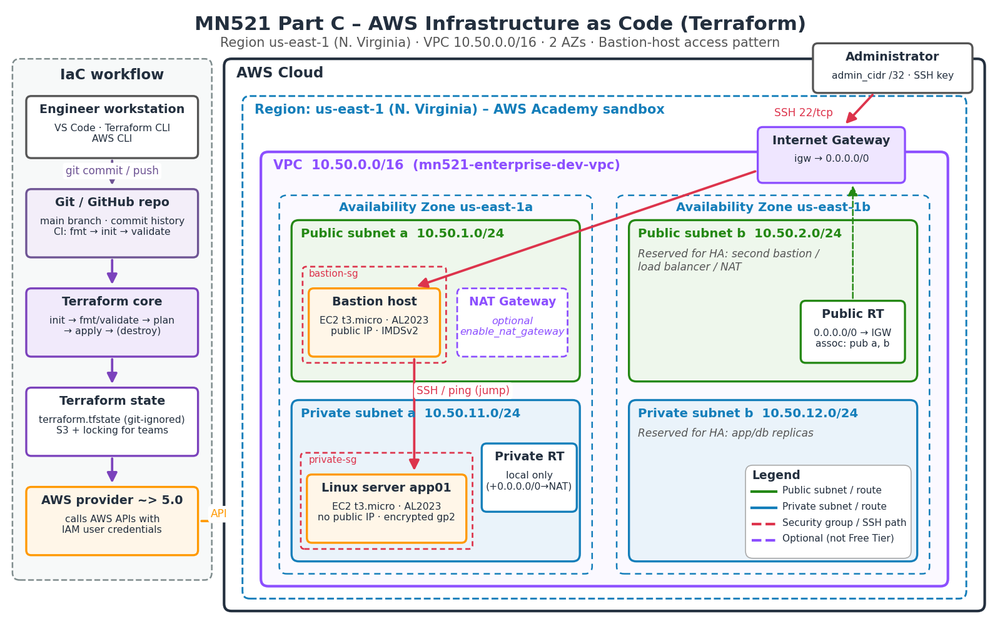

# MN521 Part C – AWS Infrastructure as Code with Terraform

Terraform project that provisions the cloud segment of the enterprise hybrid network
(MN521 Network Automation, T2 2026 group project).



## What it builds

| Requirement (brief) | Terraform resource(s) | Module |
|---|---|---|
| One VPC | `aws_vpc.this` – 10.50.0.0/16, DNS support/hostnames on | network |
| Two public subnets | `aws_subnet.public["a"/"b"]` – 10.50.1.0/24, 10.50.2.0/24 (2 AZs) | network |
| Two private subnets | `aws_subnet.private["a"/"b"]` – 10.50.11.0/24, 10.50.12.0/24 (2 AZs) | network |
| Internet Gateway | `aws_internet_gateway.this` | network |
| Route tables | `aws_route_table.public` (0.0.0.0/0 → IGW), `aws_route_table.private` (local only) + 4 associations | network |
| Security groups | `bastion-sg` (SSH from `admin_cidr` only), `private-sg` (SSH + ICMP from `bastion-sg` only) | security |
| Bastion host | `aws_instance.bastion` – t3.micro, Amazon Linux 2023, public subnet a | compute |
| EC2 Linux instance | `aws_instance.private` – t3.micro, Amazon Linux 2023, private subnet a, no public IP | compute |
| SSH key pair | `tls_private_key.ssh` (ED25519) + `aws_key_pair.this` + local `.pem` (0400) | compute |
| *(optional)* NAT Gateway | `aws_nat_gateway.this` when `enable_nat_gateway = true` | network |

Security hardening: IMDSv2 enforced, encrypted gp2 root volumes, SSH password and
root login disabled via `user_data`, SSH never open to `0.0.0.0/0` (variable validation
rejects it), private tier egress limited to the VPC.

## Layout

```
.
├── versions.tf              # Terraform + provider version pinning
├── providers.tf             # AWS provider, region, default tags
├── variables.tf             # Inputs with validation
├── main.tf                  # Calls the three modules
├── outputs.tf               # IDs, IPs and ready-made SSH commands
├── backend.tf               # Remote state (S3) guidance
├── terraform.tfvars.example # Copy to terraform.tfvars
├── modules/
│   ├── network/             # VPC, subnets, IGW, route tables, optional NAT
│   ├── security/            # Security groups and rules
│   └── compute/             # Key pair, bastion, private EC2, user_data template
├── docs/architecture.png    # AWS architecture diagram
└── .github/workflows/terraform-ci.yml  # fmt / validate on every push
```

## Prerequisites

* Terraform ≥ 1.6, AWS CLI v2, Git
* An AWS IAM user (not root) with access keys configured: `aws configure`
  (region `us-east-1`; with AWS Academy, paste the sandbox credentials into `~/.aws/credentials`)

## Usage

```bash
cp terraform.tfvars.example terraform.tfvars   # set admin_cidr to <your-ip>/32
terraform init            # download providers, initialise modules
terraform fmt -recursive  # canonical formatting
terraform validate        # static checks
terraform plan -out=tfplan
terraform apply tfplan
terraform output          # IDs, IPs, SSH commands
```

Connect:

```bash
# bastion
ssh -i keys/mn521-enterprise-dev-key.pem ec2-user@<bastion_public_ip>
# private server through the bastion
terraform output -raw ssh_to_private_via_bastion   # copy/paste the command
```

Tear down when finished to avoid charges:

```bash
terraform destroy
```

## Security notes

* `terraform.tfstate` stores resource attributes – including the generated private
  key – in plaintext, so it is git-ignored. For team use enable the S3 backend in
  `backend.tf` (encryption + state locking).
* `*.tfvars`, `*.pem` and `keys/` are git-ignored.
